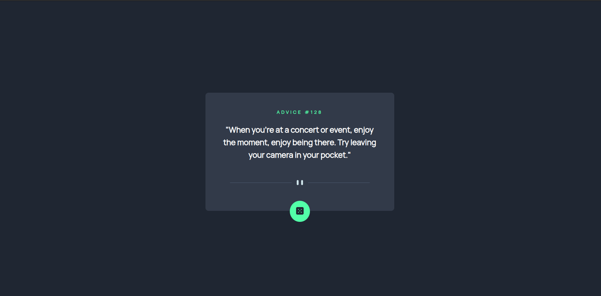

# Frontend Mentor - Advice generator app solution

This is a solution to the [Advice generator app challenge on Frontend Mentor](https://www.frontendmentor.io/challenges/advice-generator-app-QdUG-13db). Frontend Mentor challenges help you improve your coding skills by building realistic projects.

## Table of contents

- [Overview](#overview)
  - [The challenge](#the-challenge)
  - [Screenshot](#screenshot)
  - [Links](#links)
- [My process](#my-process)
  - [Built with](#built-with)
  - [What I learned](#what-i-learned)
  - [Continued development](#continued-development)
  - [Useful resources](#useful-resources)

## Overview

### The challenge

Users should be able to:

- See hover states for all interactive elements on the page
- Generate a new piece of advice by clicking the dice icon

### Screenshot



### Links

- Live Site URL: [Link](https://azanra.github.io/advice-generator/)

## My process

### Built with

- Javascript classes
- Fetch Promises

### What I learned

Using class to construct an object. class in javascript is not really as the same as the on in the other programming language, under the hood. the constructor is actually function constructor and the method is put on the prototype property of the object

```js
class Example {
  constructor() {
    //create something
  }
  method() {
    //do something
  }
}
```

is the same as

```js
function Example() {
  //create something
}

Example.prototype.method = function () {
  //do something
};
```

Remember that every object have hidden protoype property, which on it's own is an object itself,and the prototype object is inheriting the property from the prototype property of object. creating inheritance chains.

The difference is that between class and function constructor is that you need to use new keyword to initiate the instance of the class, else it will throw an error, unlike function constructor. Also they have their internal property set enumarable set to false, based on my understanding enumerable is you can loop through the object and access the property. and they also use strict mode on the classes.

Before moving on to fetch, there are what is called synchronous and asynchrounous, based off on my understanding is that synchronous is how a normal code works, it works one code at a time before it can proceed to the next one. while in asynchrounous the code will works in parallel, current code execution will not halt the other code execution. in this case it used to fetch data from the endpoint. while
waiting for the data to being sent and retrieved from the endpoint, other code will not blocked, and still continue to be executed. next is promises, promises work in asynchrounous, in promises there are three state, successfull, failed, and on hold or pending. and fetch is a promises method that being used to communicate with the endpoint, and pass the url of api as argument of fetch method.

```js
fetch(url)
  .then
  //if success do something
  ()
  .catch
  // if failed do something
  ();
```

in this project it used REST API, where we will sent a type of request like, get, post, request. and there are also some parameter/body that can be added to adjust the request depending on the api itself, the data that it will return is in JSON format.

This is based off on my own understanding after reading a short documentation on freecodecamp, the goals is to get my feet wet on using api ASAP. because it's short, i only have the little understanding on what's actually going on. the reason i don't
delve into deeper like reading the mdn documentation is because i will get to it eventually on the odin project course and to avoid rabbit hole, so that my time that is dedicated for creating any project is not consumed by reading the docs. i already
dedicated some time to only read the docs and learning new concepts. but i'm currently in class section of odin javascript part, which still far away from reaching the synchronous and asynchrounous section in odin project. especially with amount of documentation like mdn that i need to get through.

### Continued development

I still don't know when should i use constructor, factory, module, and classes. when is the right time to use certain pattern?, but from all of them, the one that i lack practice the most is definitely the class, which i think will be focus on my next project.

### Useful resources

- [FreeCodeCamp how to make api calls in javascript](https://www.freecodecamp.org/news/make-api-calls-in-javascript/) - Article to get to using API ASAP in javascript
